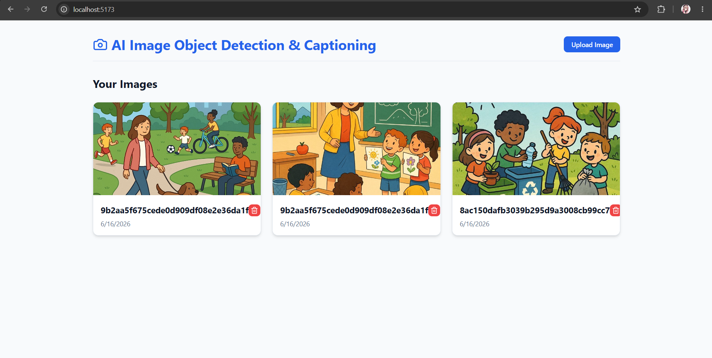
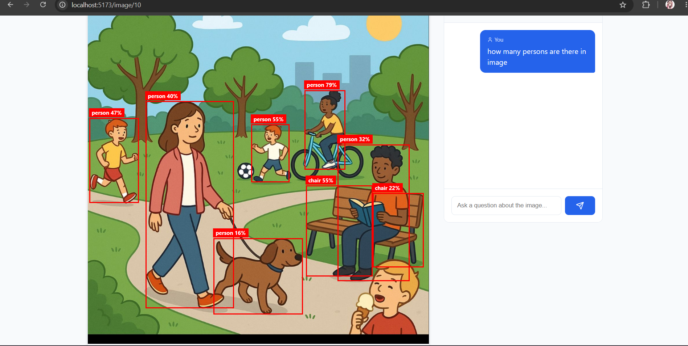

# AI-Powered Image Analysis Platform

A full-stack web application that allows users to upload images, automatically detect objects using YOLOv8, and interact with the uploaded images through natural language via Google Gemini 2.5 Flash. The application provides complete CRUD functionality for managing uploaded images.

## Project Overview

- **Image Upload + Detection**: Upload an image, run YOLO object detection, and view the image with drawn bounding boxes.
- **Chat / Captioning**: Request AI-generated captions or ask follow-up questions about the image using the Gemini API. Chat history is maintained.
- **Full CRUD on Images**: Create, Read, Update, and Delete images alongside their metadata, detections, and chat history.
- **Architecture**: React + Vite (Frontend) and Django + FastAPI (Backend).

## Environment Variables Needed

Create a `.env` file in the `backend` directory based on the `.env.example` provided. The following variables are required:

```env
DJANGO_SECRET_KEY=your-secret-key-here
DEBUG=True
DATABASE_URL=sqlite:///db.sqlite3
GEMINI_API_KEY=your_gemini_api_key_here
MEDIA_ROOT=media/
MEDIA_URL=/media/
YOLO_MODEL=yolov8n.pt
```

## Setup Steps

### Prerequisites
- Python 3.10+
- Node.js 18+

### Backend Setup
1. Navigate to the backend directory:
   ```bash
   cd backend
   ```
2. Create and activate a virtual environment:
   ```bash
   python -m venv venv
   .\venv\Scripts\activate
   ```
3. Install dependencies:
   ```bash
   pip install -r requirements.txt
   ```
4. Copy the environment variables template and configure your API keys:
   ```bash
   copy ..\.env.example .env
   ```
5. Run Migrations:
   ```bash
   python manage.py migrate
   ```

### Frontend Setup
1. Navigate to the frontend directory:
   ```bash
   cd frontend
   ```
2. Install dependencies:
   ```bash
   npm install
   ```

## How to Run It

### 1. Start the API Server
Ensure your virtual environment is activated in the `backend` directory:
```bash
cd backend
.\venv\Scripts\activate
uvicorn fastapi_service.main:app --host 0.0.0.0 --port 8001 --reload
```

### 2. Start the Frontend App
Open a new terminal, navigate to the `frontend` directory, and start the development server:
```bash
cd frontend
npm run dev
```

The application will be accessible at `http://localhost:5173`. 
The API documentation can be viewed at `http://localhost:8001/docs`.

## Screenshots/GIF of the working app





---
